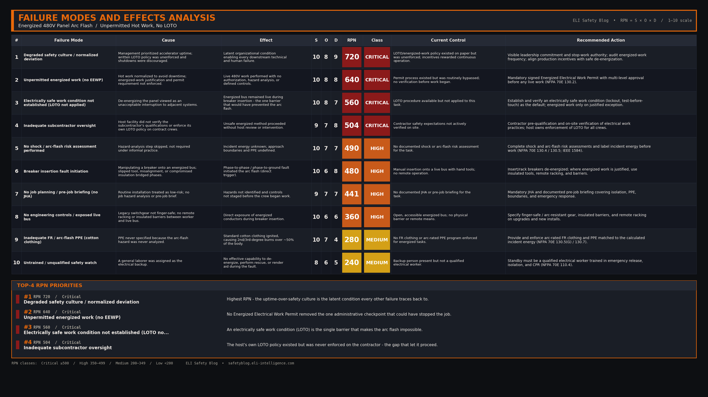

import Quiz from '../../components/Quiz.astro';

### 1. The Hook (Flashpoint)

At 11:15 a.m., the blinding white light of a 480-volt electrical arc instantly filled the cramped mechanical room, immediately followed by the concussive shockwave of expanding plasma. A subcontractor electrician, attempting to install a 30-amp circuit breaker into a live electrical panel, was thrown backward as his non-flame-resistant clothing ignited. In a fraction of a second, a routine installation task had escalated into a catastrophic failure, leaving the worker with severe second- and third-degree burns over 50% of his body.

### 2. The Setup

The incident occurred at a major national research laboratory in October 2004. A subcontractor electrical team was assigned to install a new circuit breaker into an existing, energized 480V distribution panel. The facility operated under immense pressure to maintain the continuous operation of its massive scientific accelerators. Equipment downtime was viewed as a critical failure. Consequently, an informal culture had developed where "hot work"—working on energized equipment to avoid shutting down adjacent systems—was normalized, despite institutional written policies that required lockout/tagout (LOTO).

### 3. The Breakdown

1. **The Assignment:** The contract electrician and an untrained backup laborer arrived at the 480V panel to install a new 30-amp, 3-pole breaker. 
2. **The Bypass:** Despite institutional rules requiring an Energized Electrical Work Permit for hot work, no permit was filed, and no justification for working energized was documented. Facility management was not informed.
3. **The PPE Failure:** The electrician was wearing a standard 100% cotton T-shirt, not the required Flame Resistant (FR) clothing or an arc flash suit, because the hazard had not been formally analyzed.
4. **The Task:** The electrician began inserting the new breaker into the energized bus of the panel. 
5. **The Flash:** During the insertion, a phase-to-phase or phase-to-ground fault occurred (likely due to a slipped tool, misalignment, or compromised insulation). The resulting arc flash caused an immediate, explosive release of thermal energy.
6. **The Aftermath:** The electrician’s standard clothing ignited. The backup laborer, unequipped and untrained to act as a safety watch, was knocked to the floor by the blast wave. The electrician sustained life-altering burn injuries requiring extensive hospitalization.

### 4. Interactive Quiz

<Quiz 
  question="Why did the arc flash result in such severe, life-altering burn injuries to the electrician?"
  options={[
    "The 480V panel had an abnormally high fault current that defeated his FR clothing.",
    "He was wearing standard cotton clothing instead of the required Flame Resistant (FR) PPE.",
    "The backup laborer panicked and accidentally pushed the electrician into the panel.",
    "The arc flash suppressors inside the panel failed to deploy."
  ]}
  correctAnswer="He was wearing standard cotton clothing instead of the required Flame Resistant (FR) PPE."
  explanation="Standard clothing offers no protection against the immense thermal energy of an arc flash and can actually melt or ignite, significantly worsening the burn injuries. Proper FR clothing is the last line of defense."
/>

### 5. The RCA

**Direct Cause:** 
The immediate cause of the injury was an electrical arc flash created while physically manipulating a circuit breaker onto an energized 480V bus, coupled with the lack of appropriate Flame-Resistant PPE which allowed his clothing to ignite.

**Systemic/Human Cause:** 
The root cause was a degraded safety culture driven by operational pressure. The facility's management prioritized "uptime" over safety, creating an environment where subcontractors felt compelled to bypass LOTO procedures and perform unpermitted, hazardous hot work to avoid interrupting the laboratory's operations. The failure to conduct a Pre-Work Hazard Analysis and the assignment of an untrained laborer as a backup further compounded the systemic breakdown.

### 6. Failure Modes and Effects Analysis (FMEA)

  
Click to view the FMEA Table for the 480V Panel Arc Flash

  

### 7. Codes & Standards

* **NFPA 70E 130.2** — Energized work permit; the two valid justifications for energized work (de-energizing introduces a greater hazard, or is infeasible by design)
* **NFPA 70E 130.4** — Shock risk assessment and limited/restricted approach boundaries
* **NFPA 70E 130.5 / 130.5(G)** — Arc-flash risk assessment, incident energy determination, and arc-rated PPE selection
* **OSHA 29 CFR 1910.333(a)(1)** — De-energize live parts to which an employee may be exposed before working on or near them
* **CSA Z462 Clause 4.1 / 4.3** — Energized electrical work permits, approach boundaries, and PPE requirements (Canadian equivalent to NFPA 70E)
* **IEEE 1584** — Guide for performing arc-flash hazard incident-energy calculations

### 8. Lead Magnet CTA

A strong safety culture doesn't rely on assumptions; it relies on strict procedural verification. If hot work is absolutely necessary, it must be rigorously planned and permitted. Download our **Energized Electrical Work Permit Verification Checklist** to ensure every requirement of NFPA 70E/CSA Z462 is met before a tool ever touches a live panel. 

[Download the Energized Electrical Work Permit Checklist](/downloads/energized-work-permit-verification-checklist.pdf)

### 9. Actionable Takeaways

- **Ban Convenience Hot Work:** Hot work should only be performed when de-energizing creates a greater hazard (like shutting off hospital ventilation) or is physically impossible. "It's inconvenient to shut down" is never a legal or ethical justification for working live.
- **Enforce the Permit Process:** Require multi-level management sign-off on an Energized Electrical Work Permit. If it takes three signatures to work live, technicians are far more likely to simply schedule an outage.
- **Train the Backup:** A safety watch or "standby person" must be fully trained in CPR, emergency isolation procedures, and the specific hazards of the task. An untrained laborer is not a safety watch.

### 10. Closing Statement

When operational speed becomes the unwritten priority of an organization, procedures like LOTO are treated as obstacles rather than lifelines, inevitably transforming routine maintenance into catastrophic failure.

{/*
CONFIG BLOCKS FOR CLAUDE GENERATION

BANNER CONFIG:
{
  "PUB_DATE": "2026-06-02",
  "TITLE": ["THE SPEED OF CULTURE", "480V PANEL ARC FLASH"],
  "SUBTITLE": "480V Panel Arc Flash incident",
  "FEATURE_STRIP": "WEEKLY INCIDENT RCA",
  "HAZARDS": [
    ["ARC FLASH", "L3"],
    ["LOTO BYPASS", "L3"],
    ["CULTURE FAILURE", "L3"],
    ["PPE ABSENCE", "L3"]
  ],
  "CATEGORIES": "ARC FLASH  ·  LOCKOUT TAGOUT  ·  SAFETY CULTURE",
  "SYMBOL_PATH": "rca_symbol.png",
  "OUTPUT_FILE": "../../../ai-in-mining-blog/src/assets/banner-the-speed-of-culture.png"
}

FMEA CONFIG:
{
  "incident_name": "The Speed of Culture: 480V Panel Arc Flash",
  "critical_modes": [
    {"mode": "Untrained Safety Watch", "effect": "Inability to safely rescue or de-energize during fault", "rpn": 192},
    {"mode": "Lack of Arc Flash PPE", "effect": "Ignition of standard clothing, severe burns", "rpn": 150},
    {"mode": "Unpermitted Energized Work", "effect": "Exposure to catastrophic arc flash hazard", "rpn": 140}
  ],
  "high_modes": [],
  "medium_modes": []
}

LEAD MAGNET CONFIG:
{
  "title": "Energized Electrical Work Permit Verification",
  "sections": [
    {"name": "Justification", "items": ["Is de-energizing impossible or does it create a greater hazard?", "Is the justification documented and signed by the plant manager?"]},
    {"name": "Hazard Analysis", "items": ["Has the shock risk assessment been completed?", "Has the arc flash risk assessment been completed and incident energy calculated?"]},
    {"name": "Boundaries & PPE", "items": ["Is the arc flash boundary barricaded to prevent unqualified entry?", "Is the technician wearing FR clothing and face/head protection rated for the calculated incident energy?"]},
    {"name": "Safety Watch", "items": ["Is a dedicated, qualified safety watch stationed outside the arc flash boundary?", "Is the safety watch trained in emergency release, CPR, and isolation?"]}
  ]
}

LINKEDIN POST DRAFT:
Hook: Is your facility's demand for "uptime" putting your electricians in the blast zone?
Setup: In 2004, a subcontractor at a national laboratory was severely burned by a 480V arc flash while installing a breaker into a live panel. No hot work permit was filed, and he wasn't wearing FR clothing.
Core Failure: The root cause wasn't just a slipped tool. It was a facility culture that prioritized continuous operation over safety, normalizing the dangerous practice of working on energized equipment to avoid downtime.
Takeaway: "It's inconvenient to shut down" is never a valid justification for hot work. If your culture values speed over lockout/tagout, a catastrophic arc flash is only a matter of time.
CTA: How hard is it to get approval for an equipment shutdown at your facility? Does maintenance always lose to production?
Hashtags: #ArcFlash #ElectricalSafety #NFPA70E #SafetyCulture #LockoutTagout
*/}
