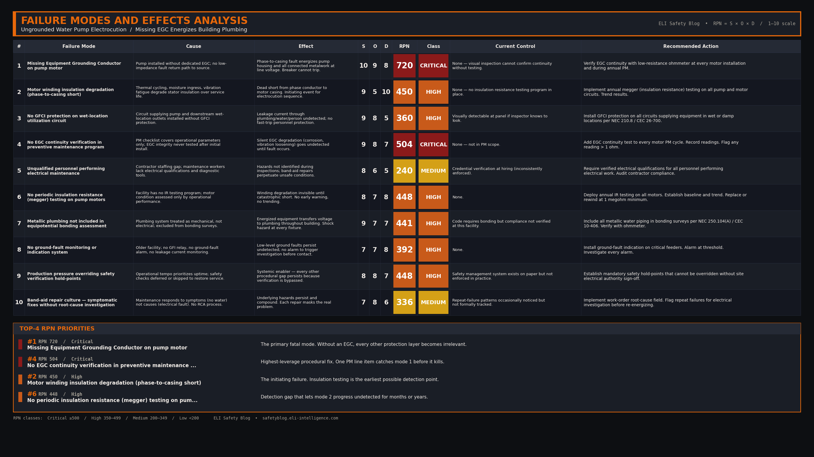

import Quiz from '../../components/Quiz.astro';

### 1. The Hook (Flashpoint)

The water turned deadly the moment the shower was turned on. A young worker housed at a large overseas facility complex stepped into the water and was instantly subjected to a lethal electrical current. The source wasn't a dropped hair dryer or a faulty light switch inside the stall. The lethal voltage was traveling directly through the pipes and the water itself, originating from a failed water pump on the building's roof.

### 2. The Setup

The incident occurred at a large industrial complex where facility maintenance was outsourced to a third-party contractor. The building in question was an older structure retrofitted with a rooftop water pump to maintain pressure for the showers below. 

Electrical safety in the complex had been a known, chronic issue. Inspections had previously revealed widespread electrical hazards, including improper splicing, lack of GFCI protection, and missing equipment grounding conductors. Despite these warnings, maintenance personnel—many of whom were reportedly undertrained and lacking proper diagnostic tools—frequently performed "band-aid" fixes to keep the water flowing rather than addressing the root electrical topology. The environment was high-pressure, prioritizing operational uptime over rigorous adherence to electrical codes.

### 3. The Breakdown

1. **The Pump Failure:** The motor winding insulation inside the rooftop water pump degraded and ultimately failed, causing a dead short to the pump's metal casing.
2. **The Missing Path:** The pump had been installed without an Equipment Grounding Conductor (EGC). When the phase wire shorted to the casing, there was no low-impedance path to return the fault current to the source.
3. **The Breaker Stays Closed:** Because the fault current had no return path to trip the overcurrent protection device (the breaker), the circuit remained energized.
4. **The Plumbing Becomes the Path:** The energized pump casing was mechanically connected to the building's metallic plumbing system. The pipes themselves became energized at line voltage.
5. **The Incident:** When the worker turned on the shower, the water and the wet floor provided the path to earth. The current traveled through the plumbing, through the water stream, and through the worker's body, resulting in fatal electrocution.

### 4. Interactive Quiz
<Quiz 
  question="Why didn't the circuit breaker trip when the water pump motor shorted to its casing?"
  options={[
    "The breaker was oversized for the pump load.",
    "The plumbing system provided too much resistance to trip the breaker.",
    "There was no equipment grounding conductor to provide a low-impedance fault return path.",
    "The water acted as an insulator until someone stepped into the shower."
  ]}
  correctAnswer="There was no equipment grounding conductor to provide a low-impedance fault return path."
  explanation="Without a dedicated Equipment Grounding Conductor (EGC), the fault current must try to return through high-impedance paths (like concrete, earth, or plumbing). This restricts the current to a level too low to trip the breaker, leaving the equipment and pipes lethally energized."
/>

### 5. The RCA

**Direct Cause:** A phase-to-casing short inside the water pump motor energized the connected plumbing system because the pump was missing its Equipment Grounding Conductor (EGC).

**Systemic/Human Cause:** The facility maintenance program normalized deviance by tolerating widespread code violations. The contractor failed to ensure that personnel performing electrical work were qualified, equipped with the right testing tools, and held to strict electrical codes (such as verifying EGC continuity during installation and maintenance). Production pressure superseded safety verification.

### 6. Failure Modes and Effects Analysis (FMEA)

  
Click to view the FMEA Table for the Un-grounded Pump Failure

  

### 7. Codes & Standards

* **NEC 250.4(A)(5)** — Effective ground-fault current path
* **NEC 250.112** — Grounding of specific equipment
* **NEC 250.114** — Equipment in wet or damp locations
* **NFPA 70E Article 110.5** — Electrical safety program requirements
* **OSHA 1910.304(g)(5)** — Permanent and continuous path to ground
* **CEC Rule 10-206** — Effective ground-fault current path
* **CEC Rule 10-400** — Continuity of equipment bonding conductor
* **CEC Section 26** — Installation of electrical equipment (motors)

### 8. Lead Magnet CTA

Are you verifying the continuity of your Equipment Grounding Conductors during preventative maintenance, or just assuming they are intact? A missing ground wire is a silent trap waiting to spring. Download our **EGC Continuity & Bonding Verification Checklist** to ensure every piece of rotating equipment on your site has a confirmed, low-impedance path to clear faults. 

[Download the EGC Continuity Verification Checklist](/downloads/egc-continuity-verification-checklist.pdf)

### 9. Actionable Takeaways

* **Never Trust the Conduit Alone:** In harsh or high-vibration environments (like pump motors), do not rely solely on metallic conduit or flex for grounding. Always pull a dedicated, sized Equipment Grounding Conductor.
* **Verify the Loop:** A visual inspection of a green wire isn't enough. Use a low-resistance ohmmeter or appropriate test instrument to verify the continuity of the ground fault return path all the way back to the source.
* **GFCI Protection for Wet Locations:** Any equipment supplying water or operating in wet environments must incorporate GFCI protection to detect leakage current before it reaches lethal levels.

### 10. Closing Statement

A ground wire doesn't make the motor spin, but it is the only thing that ensures a failure trips the breaker instead of killing the operator.

{/*
CONFIG BLOCKS FOR CLAUDE GENERATION

BANNER CONFIG:
{
  "PUB_DATE": "2026-05-26",
  "TITLE": ["MISSING EGC", "ELECTROCUTION"],
  "SUBTITLE": "Rooftop water pump phase-to-ground fault",
  "FEATURE_STRIP": "WEEKLY INCIDENT RCA",
  "HAZARDS": [
    ["MISSING GROUNDING CONDUCTOR", "L3"],
    ["MOTOR INSULATION FAILURE", "L2"],
    ["NO GFCI PROTECTION", "L2"],
    ["UNQUALIFIED PERSONNEL", "L1"]
  ],
  "CATEGORIES": "ELECTROCUTION  ·  GROUNDING  ·  MAINTENANCE  ·  CONTRACTOR SAFETY",
  "SYMBOL_PATH": "rca_symbol.png",
  "OUTPUT_FILE": "../../../ai-in-mining-blog/src/assets/banner-shower-electrocution.png"
}

FMEA CONFIG:
{
  "incident_name": "Rooftop Water Pump Electrocution",
  "critical_modes": [
    {"mode": "Missing Equipment Grounding Conductor", "effect": "Casing and plumbing remain energized during phase-to-ground fault", "rpn": 720}
  ],
  "high_modes": [
    {"mode": "Motor insulation failure", "effect": "Phase shorts to casing", "rpn": 450},
    {"mode": "Lack of GFCI protection on wet-location equipment", "effect": "Leakage current undetected", "rpn": 360}
  ],
  "medium_modes": [
    {"mode": "Unqualified maintenance personnel", "effect": "Hazards not identified during inspections", "rpn": 240}
  ]
}

LEAD MAGNET CONFIG:
{
  "title": "EGC Continuity Verification Checklist",
  "sections": [
    {"name": "Visual Inspection", "items": ["Verify dedicated EGC is pulled", "Check termination tightness"]},
    {"name": "Testing", "items": ["Perform low-resistance continuity test to source", "Verify resistance is < 1 ohm"]}
  ]
}

LINKEDIN POST DRAFT:
Hook: The water turned deadly the moment the shower was turned on.
Setup: At a large facility, a rooftop water pump failed and shorted to its casing. Because the pump was missing an Equipment Grounding Conductor, the breaker never tripped. 
Core Failure: The energized casing transferred line voltage directly into the building's plumbing system. When a worker turned on the shower, the water became the path to earth, resulting in a fatal electrocution.
Takeaway: A ground wire doesn't make the motor spin, but it is the only thing that guarantees a failure trips the breaker instead of killing the operator. Verify your EGC continuity!
CTA: How does your site test the integrity of ground fault return paths on aging equipment?
Hashtags: #ElectricalSafety #Grounding #ArcFlash #Maintenance #Engineering
*/}
