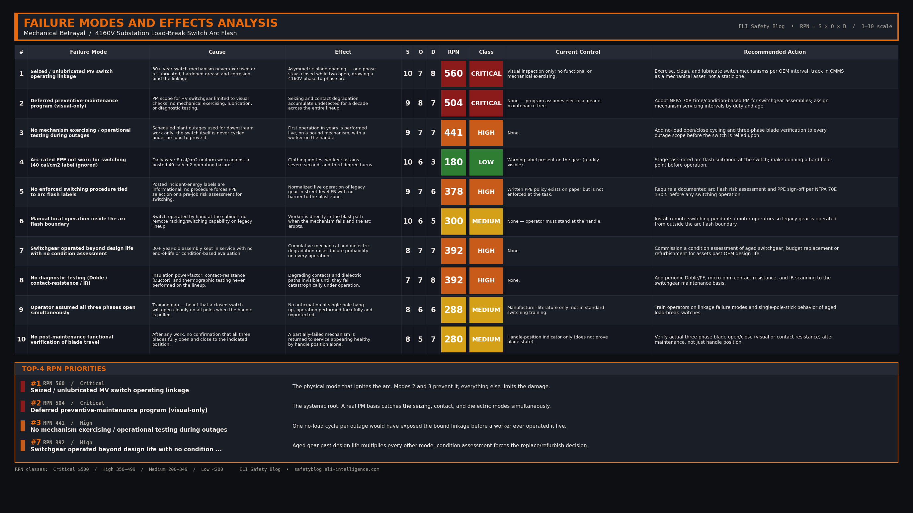

import Quiz from '../../components/Quiz.astro';

### 1. Incident Overview

At 2:30 p.m. during a scheduled plant outage, an experienced high-voltage electrician was tasked with opening a 4160V load break disconnect switch in a primary substation. As he pulled the external operating handle to open the switch, a massive phase-to-phase arc flash erupted inside the cabinet. The intense thermal energy blew the heavy steel doors open, engulfing the worker. Due to wearing inadequate arc-rated PPE for the task, the electrician sustained severe burn injuries.

### 2. Background & Context

The incident occurred at a heavy manufacturing facility in 2015. The substation switchgear was over 30 years old. While the facility had a robust electrical safety program on paper, "preventative maintenance" for the high-voltage switchgear largely consisted of visual inspections rather than mechanical exercising and lubrication. The electrician assumed that because the switch was physically closed, pulling the handle would seamlessly open all three phases simultaneously. He was wearing an 8 cal/cm² daily wear uniform, despite the equipment label warning of a 40 cal/cm² hazard for operating the switch.

### 3. Sequence of Events

1. **The Assignment:** The electrician was dispatched to isolate a 4160V feeder for downstream transformer maintenance.
2. **The Approach:** He approached the switchgear wearing his standard daily FR uniform (8 cal/cm²) and safety glasses, rather than donning the required 40 cal/cm² arc flash suit and hood.
3. **The Operation:** He unlatched the external operating handle and pulled it forcefully downward to open the switch blades.
4. **The Mechanical Failure:** Inside the cabinet, the decades-old, unlubricated mechanical linkage snapped. The operating handle moved fully to the "OPEN" position, but only two of the three internal switch blades actually opened. The third blade remained stuck closed.
5. **The Arc:** The sudden asymmetry in the magnetic fields and the compromised dielectric distance between the stuck blade and the opening blades caused the air to ionize. A 4160V arc jumped across the phases.
6. **The Blast:** The arc instantly vaporized the copper contacts, creating an explosive expansion of plasma and copper vapor. The cabinet doors blew open, and the electrician absorbed a massive amount of radiant heat.

### 4. Knowledge Check

<Quiz 
  question="Why did the arc flash occur when the operator pulled the switch handle?"
  options={[
    "The upstream utility transformer experienced a sudden voltage surge.",
    "A mechanical linkage broke, causing one phase to stick closed while the others opened.",
    "The electrician was not wearing the correct arc-rated PPE.",
    "The 4160V cable insulation had degraded due to moisture."
  ]}
  correctAnswer="A mechanical linkage broke, causing one phase to stick closed while the others opened."
  explanation="The snapped linkage caused an asymmetric opening of the switch blades, drawing a severe arc across the compromised air gap. PPE does not prevent an arc flash; it only protects the worker from the thermal energy after the failure occurs."
/>

### 5. Root Cause Analysis (RCA)

**Direct Cause:** 
The immediate cause of the arc flash was the mechanical failure of the internal switch operating mechanism, which prevented all three phases from opening simultaneously and initiated a phase-to-phase arc. The immediate cause of the injury was the lack of appropriate incident energy-rated PPE (an arc flash suit) to protect the worker from the thermal blast.

**Systemic/Human Cause:** 
The root cause was systemic deferred maintenance. The facility treated electrical equipment as static rather than mechanical. The switch mechanisms had not been cleaned, lubricated, or exercised in over a decade, allowing the linkages to seize. Furthermore, there was a failure in the safety culture regarding PPE enforcement: operating legacy gear without the full arc flash suit had become normalized across the crew, and the warning labels posted on the equipment were not backed by any enforced procedure requiring arc-rated PPE for switching.

### 6. Failure Modes and Effects Analysis (FMEA)

  
Click to view the FMEA Table for the Substation Arc Flash

  

### 7. Applicable Codes & Standards

* **NFPA 70E 130.5** — Arc-flash risk assessment and arc-rated PPE selection
* **NFPA 70E 205.3** — General maintenance requirements for electrical equipment
* **NFPA 70B** — Standard for Electrical Equipment Maintenance (specifically chapter on switchgear assemblies and switch mechanisms)
* **OSHA 29 CFR 1910.335(a)(1)(i)** — Safeguards for personnel protection (PPE)
* **CSA Z462 — Workplace Electrical Safety** — Canadian equivalent to NFPA 70E; arc-flash risk assessment, incident energy determination, and arc-rated PPE selection (Clause 4.3)
* **CSA Z463 — Maintenance of Electrical Systems** — condition-based maintenance program requirements for electrical equipment, including switchgear mechanisms (Canadian equivalent to NFPA 70B)
* **CEC (CSA C22.1) Section 36** — High-Voltage Installations — governs the installation, guarding, and working space for the 4160V substation switchgear
* **CEC (CSA C22.1) Rule 2-304** — Disconnection: equipment must be de-energized and locked out before work unless complete disconnection is not feasible

### 8. Free Resource

Don't let your high-voltage equipment become a ticking time bomb due to mechanical neglect. Ensure your switchgear is getting the maintenance it requires to operate safely.

[Download the High-Voltage Switchgear Maintenance Checklist](/downloads/switchgear-maintenance-checklist.pdf)

### 9. Actionable Takeaways

- **Exercise and Lubricate:** High-voltage disconnect switches are mechanical devices. They require regular exercising, cleaning, and lubrication per the manufacturer's instructions. Visual inspections are not enough.
- **Respect the Label:** An arc flash label is not a suggestion. If the label specifies a 40 cal/cm² hazard for operating a switch, you must don the full arc flash suit and hood, even if you are just pulling an external handle.
- **Remote Racking and Switching:** Whenever possible, eliminate the human element from the blast zone. Invest in remote switching pendants or "chicken switches" to operate legacy gear from outside the arc flash boundary.

### 10. Conclusion

Electrical safety isn't just about wires and insulation; it's heavily dependent on mechanical reliability. When preventative maintenance is deferred, internal mechanisms seize and snap, transforming routine operations into catastrophic, life-altering events.

{/*
CONFIG BLOCKS FOR CLAUDE GENERATION

BANNER CONFIG:
{
  "PUB_DATE": "2026-06-09",
  "TITLE": ["MECHANICAL BETRAYAL", "4160V SUBSTATION ARC FLASH"],
  "SUBTITLE": "Mechanical failure of MV switchgear",
  "FEATURE_STRIP": "WEEKLY INCIDENT RCA",
  "HAZARDS": [
    ["ARC FLASH", "L3"],
    ["DEFERRED MAINTENANCE", "L3"],
    ["PPE ABSENCE", "L3"]
  ],
  "CATEGORIES": "ARC FLASH  ·  SWITCHGEAR  ·  MAINTENANCE",
  "SYMBOL_PATH": "rca_symbol.png",
  "OUTPUT_FILE": "../../../ai-in-mining-blog/src/assets/banner-mechanical-betrayal-arc-flash.png"
}

FMEA CONFIG:
{
  "incident_name": "Mechanical Betrayal: 4160V Substation Arc Flash",
  "critical_modes": [
    {"mode": "Unlubricated Switch Linkage", "effect": "Mechanical failure causing asymmetric blade opening and arc flash", "rpn": 180},
    {"mode": "Inadequate Arc Flash PPE", "effect": "Severe burn injuries from thermal exposure", "rpn": 160}
  ],
  "high_modes": [
    {"mode": "Deferred Maintenance Program", "effect": "Failure to detect seizing mechanisms", "rpn": 120}
  ],
  "medium_modes": []
}

LEAD MAGNET CONFIG:
{
  "title": "High-Voltage Switchgear Maintenance Checklist",
  "sections": [
    {"name": "Mechanical Linkages", "items": ["Are operating mechanisms cleaned and lubricated per manufacturer specs?", "Are linkages visually inspected for stress fractures?"]},
    {"name": "Dielectric Testing", "items": ["Has a Megger test been performed to verify insulation integrity?", "Has a micro-ohmmeter (Ductor) test been performed on the contacts?"]},
    {"name": "Operational Testing", "items": ["Has the switch been mechanically exercised (opened and closed) multiple times?", "Do all three phases open and close simultaneously?"]}
  ]
}

LINKEDIN POST DRAFT:
Hook: Are your high-voltage disconnect switches ticking time bombs?
Setup: In 2015, an electrician pulled the handle to open a 4160V switch. The unlubricated mechanical linkage snapped inside, leaving one phase stuck closed. The resulting arc flash blew the cabinet doors open.
Core Failure: The facility's maintenance program only involved looking at the gear, not exercising or lubricating it. To make matters worse, the electrician ignored the 40 cal/cm2 warning label and wore only his daily uniform.
Takeaway: Electrical safety relies heavily on mechanical reliability. If you defer maintenance on the moving parts inside your switchgear, you are setting a trap for your operators.
CTA: When was the last time the primary disconnects at your facility were properly exercised and lubricated?
Hashtags: #ArcFlash #ElectricalSafety #Switchgear #Maintenance #NFPA70E
*/}
