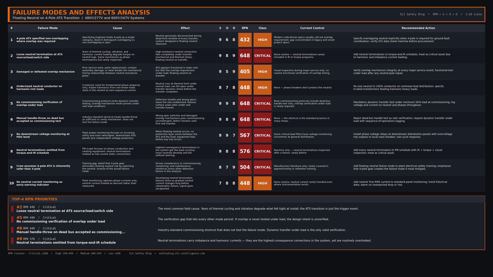

import Quiz from '../../components/Quiz.astro';

*This is a failure mode deep dive, not an incident report. It examines what happens when the neutral conductor opens during a 4-pole automatic transfer switch transition — why it happens, what downstream equipment sees, and how to protect against it.*

### 1. Incident Overview

A 4-pole automatic transfer switch is engineered to disconnect both the phase conductors and the neutral when transferring between sources. That neutral switching is what makes the generator a "separately derived system" — a designation required for proper coordination of ground-fault relays in many large commercial and industrial facilities.

But switching the neutral introduces a failure mode that 3-pole switches, where the neutral is solidly connected at all times, cannot experience. If the neutral connection is lost or interrupted under load — whether through mechanical failure, incorrect specification, or a degraded termination — the system experiences a "floating neutral" condition. The result is rapid, catastrophic overvoltage on every downstream phase-to-neutral load that happens to be lightly loaded at that moment. MOVs go into thermal runaway. UPS units fail. Lighting ballasts smoke. Control transformers saturate. In a worst-case sustained event, the failure ignites.

This is one of the most consequential failure modes in modern emergency power systems, and it is preventable by layered protection.

### 2. System Background

The defining feature of a 4-pole ATS is that the neutral pole switches in synchrony with the three phase poles. When a 4-pole ATS is required to manage ground-fault relay coordination, it is typically specified with an **overlapping neutral** mechanism — the neutral pole is engineered to make first and break last during a transition, ensuring the neutral reference is never disconnected while the phases are energized.

The system context that creates the failure mode includes:

- A 3-phase, 4-wire wye distribution system (480Y/277 V or 600Y/347 V are typical industrial configurations).
- Phase-to-neutral loads of significantly different impedance — some lightly loaded, some heavily loaded. This imbalance is what makes the floating neutral dangerous; a perfectly balanced system would not see overvoltage.
- A 4-pole ATS that switches the neutral. Whether by design (open-transition non-overlapping) or by failure (degraded mechanism, loose termination), the neutral can become disconnected during a transfer.
- Sensitive downstream equipment with no independent overvoltage protection at the load.

In a properly engineered, properly maintained system, the overlapping neutral mechanism prevents this from happening. The failure mode emerges when one of those conditions is not met.

### 3. Sequence of Events

The mechanism that drives the overvoltage is straightforward circuit analysis. In a 3-phase, 4-wire wye system, the neutral conductor anchors the center point of the wye, forcing each phase-to-neutral voltage to remain at a fixed value (e.g., 277 V in a 480Y/277 V system) regardless of how loads are distributed across the three phases.

The sequence of events when the neutral opens unfolds as follows:

- **T+0** — The neutral connection is lost. This may occur during the dead-time window of an open-transition transfer with non-overlapping switching, when a degraded neutral termination fails under transfer stress, or when a damaged overlap mechanism breaks the neutral before the phases.
- **T+0 (immediate)** — The phase-to-neutral loads are no longer referenced to a neutral. They are now placed in series across the phase-to-phase voltages. The neutral point "floats" to a new position determined by the load impedance ratios.
- **T+0 (immediate)** — A voltage divider is created. The phase with the lightest load (highest impedance) sees the largest voltage drop across its loads — potentially approaching the full phase-to-phase magnitude (480 V or 600 V depending on the system). The phase with the heaviest load sees a corresponding undervoltage.
- **T+milliseconds** — 277 V-rated equipment on the lightly loaded phase is now exposed to voltages well above its rating. MOVs in surge protection devices and switch-mode power supplies attempt to clamp the overvoltage. Because the overvoltage is sustained — not a transient — the MOVs enter thermal runaway.
- **T+seconds** — UPS systems fail. Switch-mode power supplies in IT and control equipment fail. Lighting ballasts saturate and overheat. Control transformers saturate and may smoke or arc. MOVs that have entered thermal runaway can rupture, releasing molten metal and igniting surrounding insulation.
- **T+ongoing** — Without intervention from downstream protection, the event continues until either the neutral reconnects, the source is removed, or sustained damage causes a fault that finally trips upstream protection.

 

### 4. Knowledge Check

<Quiz 
  question="In a 3-phase, 4-wire wye system, what causes the phase-to-neutral voltage to rise to dangerous levels during a floating neutral event?"
  options={[
    "The generator was incorrectly bonded as a separately derived system, creating parallel neutral-to-ground paths.",
    "The automatic voltage regulator (AVR) senses the voltage drop and overcompensates by maximizing excitation.",
    "The phase-to-neutral loads are placed in series across the phase-to-phase voltage, acting as a voltage divider based on their relative impedances.",
    "Triplen harmonics amplify the phase voltages when the neutral return path is lost."
  ]}
  correctAnswerIndex={2}
  explanation="When the neutral reference point is disconnected, the loads on different phases form series circuits between the phase conductors. The voltage drops across these loads are proportional to their impedance, meaning the phase with the lightest load (highest impedance) will see the highest voltage, potentially approaching the full phase-to-phase voltage. This is pure circuit analysis — no exotic physics, no harmonic amplification, no AVR misbehaviour. Just a voltage divider where the divider ratio is set by whatever loads happen to be running."
/>

### 5. Root Cause Analysis

**Direct Cause:**
A floating neutral event is caused by the loss of the neutral reference connection during a 4-pole ATS transfer. The most credible field mechanisms are:

- **Loose neutral termination.** The most common field failure. Over years of thermal cycling and vibration, a neutral termination at the source, switch, or load side can loosen. When subjected to the dynamic mechanical and thermal stress of a transfer, the high-resistance connection can fail completely, opening the neutral path.
- **Incorrect ATS specification.** If a standard non-overlapping 4-pole switch is specified where an overlapping (make-before-break) neutral was required, the neutral is genuinely disconnected for the dead-time window during open-transition transfer.
- **Damaged or defeated overlapping mechanism.** The mechanical linkage designed to overlap the neutral transition can be damaged from prior service work, parts replacement, or wear, causing the neutral to break before the phases during a transfer.
- **Failed neutral conductor.** In facilities with high non-linear load content (such as data centers), triplen harmonics can cause the neutral to carry more than the phase current. If the neutral conductor is undersized, it can thermally fail and open under load before the transfer occurs.

A single mechanical pole binding while the other three poles operate normally is *not* on this list. It is not a credible failure mode in a properly designed, mechanically interlocked ATS — the poles are physically tied to a common shaft.

**Systemic/Human Cause:**
Floating neutral failures persist because of layered organizational gaps. The specification may not require overlapping-neutral gear when the ground-fault coordination scheme demands it. Commissioning rarely tests transfer dynamics under real load — manual handle-throw on a dead bus does not stress the overlap mechanism. Maintenance programs often omit neutral terminations from the torque-and-thermographic schedule even though they carry imbalance and harmonic currents and are the highest-consequence connection points in the system. Downstream protection rarely includes voltage monitoring at the PDU level, leaving sensitive equipment with no independent line of defence. Each of these gaps is individually correctable; together they create the conditions for catastrophic failure.

### 6. Failure Modes & Effects Analysis

### 7. Codes & Standards

- **CEC Section 10** — Grounding and bonding. The Canadian equivalent to NEC 250, governing the grounding of separately derived systems.
- **CEC Section 46** — Emergency Power Supply, Unit Equipment, Exit Signs, and Life Safety Systems.
- **CSA C282** — Emergency electrical power supply for buildings. The Canadian equivalent governing standby system design and testing.
- **NEC 250.30** — Grounding of separately derived AC systems. Defines when a 4-pole ATS is required and how the generator must be bonded as a separately derived system.
- **NEC Articles 700, 701, 702, 708** — Emergency Systems, Legally Required Standby Systems, Optional Standby Systems, and Critical Operations Power Systems (COPS).
- **NFPA 110** — Emergency and standby power systems. Performance, installation, and maintenance requirements for transfer equipment.
- **IEEE 446 (Orange Book)** — Recommended practice for emergency and standby power systems for industrial and commercial applications.

 

### 8. Resources

[Transfer Switch Commissioning Verification Checklist](/downloads/transfer-switch-commissioning-verification-checklist.pdf)

### 9. Field Actions

- **Specify overlapping-neutral 4-pole gear** when a 4-pole transition is required to manage ground-fault relaying. Do not accept standard non-overlapping switches as a substitute.
- **Verify the overlap mechanism at commissioning** under actual load — not just by manually throwing the handle during a dead-bus test. Dynamic sequence-of-operations testing under load is what proves the mechanism works as designed.
- **Install phase voltage relays** at downstream distribution panels with overvoltage trip outputs wired to the local main breaker. If the voltage drifts beyond safe tolerances, the breaker isolates the loads before sustained damage occurs.
- **Add EPMS / power monitoring** with sub-cycle voltage sampling at the PDU level. Revenue-grade meters with trip outputs provide both early warning and automated isolation.
- **Add neutral terminations to the torque-and-thermographic schedule.** Because the neutral carries imbalance and harmonic currents, these terminations are the highest-consequence connection points in the system and must not be neglected. Treat them as critical assets.
- **Monitor neutral current** as an early-warning indicator. An unexpected drop in neutral current on an unbalanced system suggests increasing impedance at a termination — a developing failure that is not yet catastrophic but will be.

### 10. Bottom Line

A floating neutral during an ATS transition is a low-probability, high-consequence failure mode capable of destroying an entire downstream infrastructure in seconds. No single protection device can reliably prevent the mechanical loss of a neutral, so the defence must be layered — precise equipment specification, rigorous load-based commissioning, active downstream voltage monitoring, and disciplined maintenance of every neutral termination. Each layer is individually weak; together they make the failure mode survivable.
