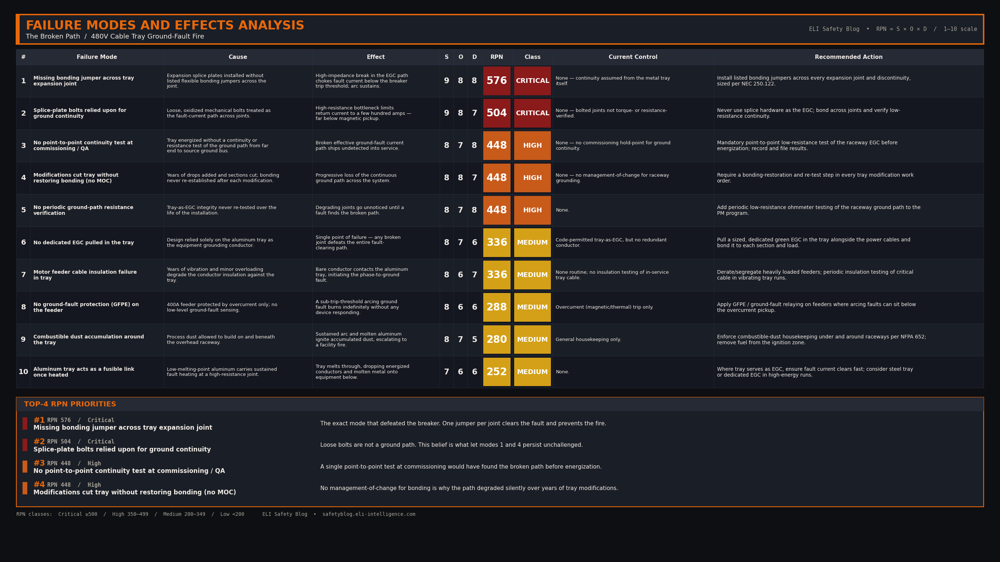

import Quiz from '../../components/Quiz.astro';

### 1. Incident Overview

At a large material processing facility, a 480V phase-to-ground fault occurred inside an overhead aluminum cable tray when a heavily loaded motor feeder cable suffered insulation failure. Instead of the upstream 400A circuit breaker instantly tripping to clear the fault, the arc sustained itself for several minutes. The continuous arcing melted the aluminum tray, ignited the surrounding accumulation of combustible dust, and set the cable insulation on fire, resulting in a multi-million dollar facility fire.

### 2. Background & Context

The facility utilized an extensive network of aluminum ladder-type cable tray to route power cables. Electrical codes allow the metal tray itself to serve as the Equipment Grounding Conductor (EGC) to carry fault current back to the source, provided it is electrically continuous. Over the years, facility maintenance had modified the tray system, cutting sections to add new drops and installing expansion splice plates to account for thermal expansion. However, they failed to install flexible bonding jumpers across these specific expansion joints.

### 3. Sequence of Events

1. **The Insulation Failure:** A 480V power cable laying in the tray, subjected to years of vibration and minor overloading, experienced an insulation breakdown. The bare copper conductor made contact with the aluminum tray.
2. **The Fault Path:** Current immediately began flowing from the faulted phase into the aluminum tray, seeking a path back to the transformer neutral to complete the circuit and trip the breaker.
3. **The High-Impedance Block:** As the fault current traveled down the tray, it encountered an expansion joint where no bonding jumper was installed. The only electrical connection across this joint was the loose mechanical bolts holding the splice plates together.
4. **The Resistance:** The loose, oxidized bolts created a high-resistance bottleneck. Instead of thousands of amps flowing back to instantly trip the magnetic pickup of the breaker, only a few hundred amps flowed.
5. **The Fire:** Because the fault current was lower than the breaker's trip setting, the breaker remained closed. The high resistance at the fault location and at the expansion joint converted the electrical energy into massive amounts of heat, melting the tray and sparking a massive fire that consumed the overhead infrastructure.

### 4. Knowledge Check

<Quiz 
  question="Why didn't the upstream 400A circuit breaker trip when the phase-to-ground fault occurred?"
  options={[
    "The circuit breaker was mechanically seized and stuck in the closed position.",
    "The missing bonding jumpers created a high-resistance path that restricted fault current below the breaker's trip threshold.",
    "Aluminum cable trays are not conductive enough to carry fault current.",
    "The transformer was undersized for the facility's load."
  ]}
  correctAnswer="The missing bonding jumpers created a high-resistance path that restricted fault current below the breaker's trip threshold."
  explanation="Breakers rely on massive, unimpeded fault current to trip instantaneously. If the ground path has high resistance (like a loose, unbonded expansion joint), it chokes the current flow, leaving the fault energized and generating immense heat."
/>

### 5. Root Cause Analysis (RCA)

**Direct Cause:** 
The immediate cause of the fire was sustained arcing and heating caused by a phase-to-ground fault that failed to clear.

**Systemic/Human Cause:** 
The root cause was a failure to maintain the Effective Ground-Fault Current Path. Contractors and maintenance personnel fundamentally misunderstood the purpose of equipment bonding. By neglecting to install listed bonding jumpers across expansion joints and modified tray sections, they broke the safety circuit. There was also a failure in commissioning and QA/QC, as no one performed a point-to-point continuity or resistance test of the cable tray system before energization.

### 6. Failure Modes and Effects Analysis (FMEA)

  
Click to view the FMEA Table for the Cable Tray Fire

  

### 7. Applicable Codes & Standards

* **NEC 250.4(A)(5)** — Effective Ground-Fault Current Path: Must be electrically continuous, have low impedance, and carry the maximum fault current.
* **NEC 392.60(B)** — Cable Tray as Equipment Grounding Conductor: Requires listed bonding jumpers across discontinuous segments.
* **IEEE 142 (Green Book)** — Grounding of Industrial and Commercial Power Systems
* **CEC (CSA C22.1) Section 10 — Grounding and Bonding** — requires the bonding/fault-return path to be electrically continuous, low-impedance, and capable of carrying the maximum fault current back to the source (Canadian counterpart to NEC 250.4(A)(5)).
* **CEC (CSA C22.1) Section 12 — Cable Trays** — installation and bonding requirements for cable tray systems, including maintaining electrical continuity across tray sections and expansion joints where the tray serves as a bonding means.
* **CEC (CSA C22.1) Table 16** — minimum bonding conductor size, based on the rating of the upstream overcurrent device (Canadian counterpart to NEC 250.122).

### 8. Free Resource

Grounding isn't just about driving a rod into the earth; it's about providing a low-impedance path to clear faults. Verify your facility's grounding integrity with our checklist.

[Download the Industrial Grounding & Bonding Verification Checklist](/downloads/grounding-bonding-verification.pdf)

### 9. Actionable Takeaways

- **Bond Every Break:** Wherever a metallic raceway or cable tray is cut, separated, or uses an expansion joint, you must install a properly sized equipment bonding jumper. Mechanical bolts and splice plates do not guarantee electrical continuity.
- **Run a Dedicated Ground Wire:** To eliminate the risk of the tray losing continuity over time, standard practice in heavy industry should be to pull a dedicated, sized green ground wire inside the tray alongside the power cables, tying it to every piece of equipment.
- **Test Continuity:** Never assume a tray is grounded just because it's metal. Use a low-resistance ohmmeter to periodically verify that the resistance from the farthest end of the tray back to the main substation ground bus is essentially zero.

### 10. Conclusion

When you break the path to ground, you defeat the circuit breaker. Proper bonding is the invisible safety net of any electrical installation; without it, a simple wire chafe turns into a facility-destroying fire.

{/*
CONFIG BLOCKS FOR CLAUDE GENERATION

BANNER CONFIG:
{
  "PUB_DATE": "2026-06-16",
  "TITLE": ["THE BROKEN PATH", "CABLE TRAY GROUND FAULT FIRE"],
  "SUBTITLE": "Improper bonding leads to sustained arcing",
  "FEATURE_STRIP": "WEEKLY INCIDENT RCA",
  "HAZARDS": [
    ["MISSING BONDING JUMPERS", "L3"],
    ["SUSTAINED GROUND FAULT", "L3"],
    ["FIRE HAZARD", "L3"]
  ],
  "CATEGORIES": "GROUNDING  ·  FIRE HAZARD  ·  CABLE TRAY",
  "SYMBOL_PATH": "rca_symbol.png",
  "OUTPUT_FILE": "../../../ai-in-mining-blog/src/assets/banner-broken-path-cable-tray-fire.png"
}

FMEA CONFIG:
{
  "incident_name": "The Broken Path: Cable Tray Ground Fault Fire",
  "critical_modes": [
    {"mode": "Missing Bonding Jumper at Expansion Joint", "effect": "High impedance ground path prevents breaker trip, sustained arcing", "rpn": 175},
    {"mode": "Cable Insulation Failure in Tray", "effect": "Phase-to-ground fault initiates onto aluminum tray", "rpn": 140}
  ],
  "high_modes": [
    {"mode": "Lack of Ground Continuity Testing", "effect": "Failure to detect broken ground path before fault occurs", "rpn": 110}
  ],
  "medium_modes": []
}

LEAD MAGNET CONFIG:
{
  "title": "Industrial Grounding & Bonding Verification Checklist",
  "sections": [
    {"name": "Cable Tray & Raceways", "items": ["Are flexible bonding jumpers installed across all expansion joints?", "Are bonding jumpers sized correctly according to NEC 250.122?"]},
    {"name": "Equipment Bonding", "items": ["Is paint removed where ground lugs attach to enclosures to ensure metal-to-metal contact?", "Are isolated ground rods correctly bonded back to the main service ground?"]},
    {"name": "Testing", "items": ["Has a point-to-point resistance test been performed on the raceway system?", "Is the resistance low enough to trip the upstream protective device?"]}
  ]
}

LINKEDIN POST DRAFT:
Hook: Is your cable tray really grounded, or are you just relying on a few loose bolts?
Setup: A facility suffered a massive electrical fire when a 480V cable faulted to an aluminum tray. The breaker never tripped. Why? Because the maintenance team failed to install bonding jumpers across the expansion joints.
Core Failure: The loose bolts at the splice plates created a high-resistance bottleneck. Instead of sending thousands of amps back to trip the breaker, it only allowed a trickle of current—turning the fault into a sustained, tray-melting arc that ignited a fire.
Takeaway: Metal does not automatically equal a ground path. The Effective Ground-Fault Current Path must be intentional, continuous, and low-impedance. If you break the path, you defeat the breaker. 
CTA: Do your facility's cable tray expansion joints have properly sized bonding jumpers installed?
Hashtags: #ElectricalSafety #GroundingAndBonding #NationalElectricalCode #FireSafety #CableTray
*/}
