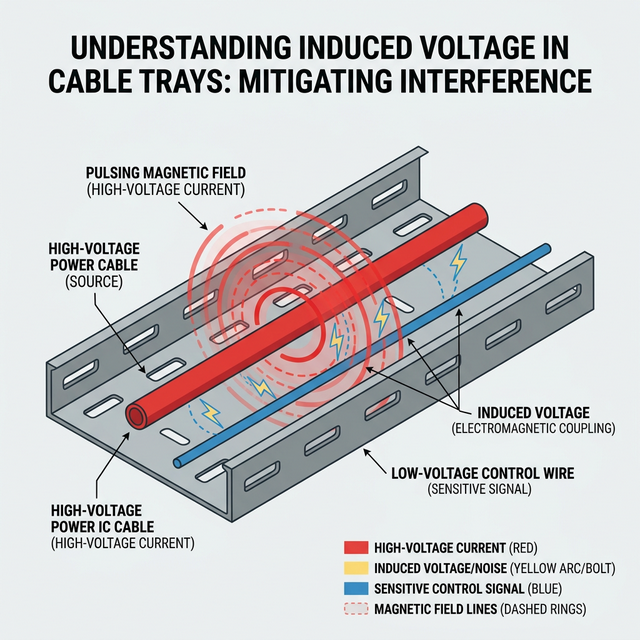

import Quiz from '../../components/Quiz.astro';

## The Incident
A maintenance technician was tasked with a "quick fix": replacing a faulty 120V control wire. The circuit was properly locked and tagged out at the source, and a quick voltage check confirmed the 120V line was dead. 

However, this control wire was routed in the same cable tray parallel to a live high-voltage 13.8kV feeder for over 100 feet. As the worker grabbed the bare end of the "dead" control wire while standing on a ladder, they received a severe electrical shock. The surprise and muscle contraction caused them to fall from the ladder, resulting in secondary injuries.

<Quiz 
  question="Why did the technician receive a shock from a 'dead' wire?"
  options={[
    "The Lockout/Tagout was improperly applied at the source break.",
    "A faulty multimeter gave a false zero-voltage reading.",
    "The parallel run with the 13.8kV line induced a voltage via electromagnetism.",
    "Residual capacitor charge was left in the 120V circuit."
  ]}
  correctAnswerIndex={2}
  explanation="When alternating current (AC) flows through the 13.8kV feeder, it creates an expanding and collapsing electromagnetic field. That magnetic field crossed the parallel control wire, inducing a voltage in it—even though it was disconnected. This is known as induced voltage or ghost voltage."
/>

## The Root Cause: Induced Voltage
The root cause of this incident was **Induced Voltage** (also known as ghost or phantom voltage), exacerbated by a failure to recognize the hazard and a lack of proper grounding.

When alternating current (AC) flows through the 13.8kV feeder, it creates an expanding and collapsing electromagnetic field. Because the unshielded 120V control wire ran parallel to this feeder for a significant distance, that magnetic field crossed the control wire, inducing a voltage in it—even though it was physically disconnected from any power source. 

While induced voltage often has low current-carrying capability (high impedance), the capacitive coupling in long cable runs can store enough energy to deliver a painful, startle-inducing shock. In an industrial environment, the fall hazard from the startle reflex is often deadlier than the shock itself.

## How Grounding Could Have Prevented It
The most effective way to eliminate the hazard of induced voltage is through proper **Protective Grounding**. 

If the technician had applied a temporary personal protective ground to the 120V control wire at the workspace, it would have accomplished two critical safety functions:
1. **Dissipation:** It provides an immediate, low-impedance path to earth, continuously draining any electromagnetically or capacitively induced charge away from the worker.
2. **Equipotential Zone:** Grounding establishes an equipotential zone, ensuring that the worker and the wire are at the exact same electrical potential. If there's no difference in potential, current cannot flow through the worker.

*A secondary preventative measure would involve proper engineering design: routing low-voltage control wiring in separate, shielded grounded conduits away from high-voltage feeders.*

## Relevant Safety Standards & Codes
This incident highlights the importance of adhering to several critical industry standards regarding grounding and induced voltage:

*   **OSHA 29 CFR 1910.269(n) (Protective Grounding):** Mandates the installation of system safety grounds to create an equipotential zone, preventing hazardous differences in electric potential for workers, and specifically addresses hazards where lines run parallel to energized circuits.
*   **NFPA 70E (Standard for Electrical Safety in the Workplace):** States that where the possibility of induced voltages or stored electrical energy exists, phase conductors or circuit parts must be temporarily grounded before employees touch them to establish an Electrically Safe Work Condition (ESWC).
*   **NEC (NFPA 70) Article 250 (Grounding and Bonding):** Emphasizes the underlying principles of grounding to limit voltages imposed by unintentional contact with higher-voltage lines and to stabilize system voltages.
*   **CEC (Canadian Electrical Code) Section 10 (Grounding and Bonding):** Emphasizes the underlying principles of grounding to limit voltages imposed by unintentional contact with higher-voltage lines and to stabilize systems.

> [!CAUTION]
> **Safety Takeaway:** Never assume a wire is safe just because the breaker is off. If it runs near high voltage, treat it as energized until it is visibly and securely grounded.
