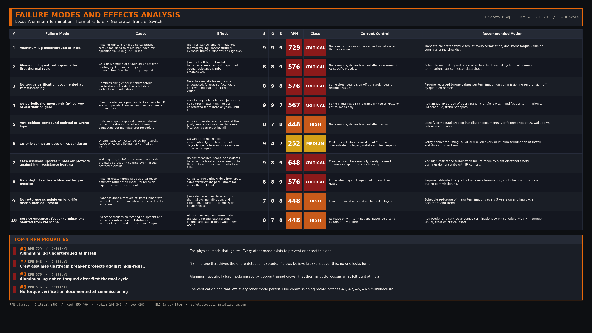

### 1. Incident Overview

It was a standard arrival at a cold vacation property on Denman Island on January 4, 2020. Seeking warmth, the homeowner’s son had already turned on a 6000 W electric in-floor boiler. Upon arriving, the homeowner turned on four additional baseboard heaters, adding another 4000 W of load to the system. The house was running normally on utility power. A few hours later, the routine arrival turned into an emergency when the homeowner noticed the distinct, acrid smell of burning plastic accompanied by the sound of electrical arcing coming from a panel in the pantry. After quickly shutting off the main breakers, the homeowner successfully extinguished the fire with a portable extinguisher, preventing what could have been a total structural loss.

### 2. System Background

The electrical system for this residence was typical for a property utilizing emergency backup heating. It featured a utility-fed 240 V, 200 A combination panel, an automatic generator transfer switch rated at 100 A (240 V), and a 100 A emergency sub-panel backed up by a 22 kW Generac generator. The heavy loads on the emergency panel included two 1250 W baseboard heaters, two 750 W baseboard heaters, and the 6000 W electric boiler. The connections feeding the emergency panel were made using 1/0 aluminum conductors.

Aluminum is a standard and safe material commonly used in residential and light-commercial service entrance and feeder applications due to its cost-effectiveness and weight compared to copper. However, aluminum behaves differently than copper. It expands and contracts more significantly with temperature changes (thermal cycling), and it rapidly forms an insulating oxide layer when exposed to air. Because of this, aluminum requires strict termination discipline: conductors must be wire-brushed and coated with an anti-oxidant compound, and the lugs must be torqued to the precise specification provided by the manufacturer. If a termination is left loose, the resistance at the joint increases, generating heat that exacerbates the thermal cycling, loosening the connection further in a dangerous downward spiral.

### 3. Sequence of Events

According to the Technical Safety BC investigation (Reference II-975771-2020), the sequence of events and subsequent findings unfolded as follows:

*   **T-2 Years (2018):** The generator, transfer switch, and emergency panel were installed.
*   **T-0 (January 4, 2020):** The 6000 W boiler was activated, followed shortly by 4000 W of baseboard heating. The system drew the load entirely from utility power; the generator was not running.
*   **T+Hours:** The homeowner discovered the fire at the transfer switch panel, isolated the power, and extinguished the flames.
*   **Post-Incident Investigation:** Investigators found that the two 1/0 aluminum conductors and lugs feeding the emergency panel were burnt completely off at the transfer switch output. Crucially, they tested the adjacent generator-input terminations (which had not failed) and found them significantly loose. Using a screwdriver, investigators were able to hand-turn the adjacent lugs an additional *five quarter turns* before they felt snug. The manufacturer's label clearly stated the required torque specification: **275 in-lbs**.

### 4. Knowledge Check

**Why didn't the upstream breakers trip and stop the fire?**

1.  The breakers were undersized for the total 10,000 W load.
2.  The GFCI didn't sense the current imbalance.
3.  Thermal runaway at a high-resistance termination produces heat without an overcurrent.
4.  The transfer switch mechanically jammed and prevented the breaker from operating.

*Answer: 3. Thermal runaway at a high-resistance termination produces heat without an overcurrent.* 

The total 10,000 W heating load draws approximately 41.6 A at 240 V, which is well within the 100 A rating of the emergency panel and its upstream breaker. A standard thermal-magnetic breaker protects against overcurrent (pulling more amps than the wire is rated for) and short circuits (a sudden, massive fault). It does *not* detect high-resistance heating at a specific joint. As the loose termination's resistance increased, it acted like a small heating element right at the lug, melting the metal without ever pulling enough total current to trip the 100 A breaker.

### 5. Root Cause Analysis

**Direct Cause:**
The direct cause of the fire was loose aluminum terminations at the transfer switch output. According to TSBC, these lugs were undertorqued during the initial installation in 2018. Over two years, the connections deteriorated due to thermal cycling. When subjected to the combined 10,000 W heating load on January 4, 2020, the high-resistance joints underwent thermal runaway, melting the lugs and conductor ends completely off the termination points.

**Systemic/Human Cause:**
The systemic failure was the lack of torque verification at commissioning. The installer did not use a torque wrench to achieve the specified 275 in-lbs, instead relying on "hand-tight" judgment. Furthermore, there was no periodic re-torque or thermographic (infrared) survey performed in the two years following installation. A simple infrared scan would have revealed the developing hot spot well before the catastrophic thermal failure occurred. Proper aluminum-specific termination practices were not verified or documented.

### 6. Failure Modes & Effects Analysis

### 7. Codes & Standards

- **CSA C22.1 (Canadian Electrical Code), Section 12:** Covers conductor termination requirements, explicitly mandating that equipment be installed and terminated using the torque values specified by the manufacturer.
- **CSA C22.2 No. 65:** The standard governing wire connectors, detailing the mechanical and performance requirements for lugs and terminations.
- **NFPA 70 (NEC) 110.14(D):** Requires that where a tightening torque is indicated as a numeric value on equipment or in installation instructions, a calibrated torque tool must be used to achieve the indicated torque value.
- **NETA MTS / ATS:** Maintenance and Acceptance Testing Specifications that cover the requirements for torque verification and periodic thermographic inspection of electrical distribution equipment.

### 8. Resources

[Termination Verification — Torque + Thermographic Field Checklist](/downloads/termination-verification-checklist.pdf)

### 9. Field Actions

- **Torque every termination to manufacturer specification at install.** Document the torque value on a commissioning checklist. "Hand-tight" is not a specification, and human judgment is notoriously poor at estimating 275 in-lbs.
- **Re-torque after the first full thermal cycle** if the connector manufacturer specifies it. Many aluminum lugs require this step to account for initial cold flow and settling.
- **Add periodic thermographic (IR) inspection** of all major distribution and transfer equipment to your maintenance program. A developing high-resistance joint will show up as a bright hot spot on an IR camera weeks or even months before it fails thermally.
- **For aluminum conductors specifically:** Always use the correct anti-oxidant compound, follow the manufacturer's exact wire preparation procedure (such as wire brushing through the compound), and ensure you are using connectors explicitly rated for aluminum (marked AL or AL/CU).
- **Do not assume upstream breakers will protect against thermal failures.** Breakers protect the circuit against overcurrent and short circuits; they are blind to high-resistance heating occurring within their rated current limits.

### 10. Bottom Line

A single undertorqued lug, hidden behind a closed panel for two years, was sufficient to destroy a transfer switch and start a fire that could have easily burned down the entire building. The protection against this class of failure is not the breaker, which operated exactly as designed by ignoring a normal 41 A load. The true protection against high-resistance thermal failures is the disciplined use of a torque wrench at installation and the routine use of an IR camera during maintenance.
