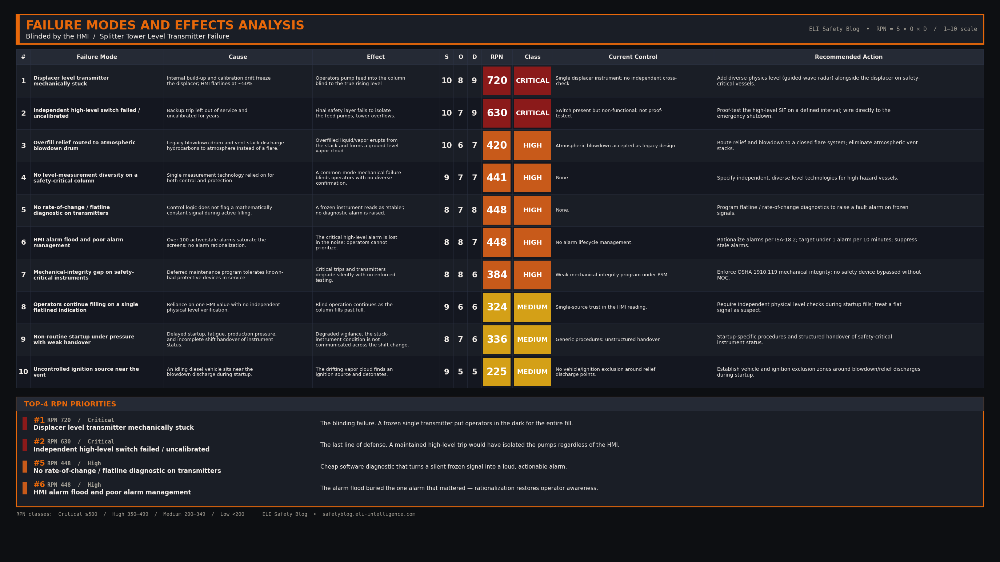

import Quiz from '../../components/Quiz.astro';

### 1. The Hook (Flashpoint)

At 1:20 PM, a massive, earth-shaking explosion ripped through the isomerization unit of a major petroleum refinery, sending a towering plume of black smoke into the air. The blast destroyed surrounding infrastructure, shattered windows miles away, and tragically claimed the lives of 15 workers while injuring 180 others in one of the worst industrial disasters in modern history.

### 2. The Setup

The isomerization unit startup had begun during the night shift, but operations had been delayed. By mid-morning, the incoming day shift operators were dealing with a complex, non-routine startup under intense pressure to restore production. The control room environment was chaotic; operators were fatigued, and the SCADA/HMI screens were saturated with an "alarm flood"—over 100 active and stale alarms that created a wall of visual noise.

The primary equipment involved was the raffinate splitter tower, a 170-foot-tall distillation column. Because it was startup, the tower was being filled with highly flammable liquid hydrocarbons. To monitor the liquid level inside the column, operators relied on a displacer-type level transmitter, which displayed the level as a percentage (0% to 100%) on their HMI screen. A backup independent high-level switch was installed on the tower to trip the feed pumps if the level exceeded a critical threshold, but it had not been functional or calibrated for several years.

### 3. The Breakdown

1. **The Startup Fill:** Operators began pumping liquid hydrocarbon feed into the bottom of the splitter tower, which required heating the liquid to initiate distillation.
2. **The Instrument Flatline:** As the liquid level rose, the displacer-type transmitter became physically stuck due to mechanical internal build-up and a calibration discrepancy. The HMI display flatlined, showing a constant level of roughly 8 feet (approx. 50% capacity).
3. **The Blind Operations:** Relying entirely on the flatline HMI display and believing the level was stable, operators continued to pump in fresh feed while applying heat to the tower bottom.
4. **The High-Level Overflow:** Because the level transmitter was stuck and the backup safety high-level switch failed to activate, the liquid level inside the 170-foot tower rose unchecked until it completely filled the column and began overflowing into the overhead vapor line.
5. **The Ignition:** Flammable liquid and vapor filled the overhead piping, overwhelmed the low-capacity blowdown drum, and erupted out of the vent stack like a geyser. The resulting massive vapor cloud drifted across the unit and was ignited by a idling diesel truck engine nearby, triggering the devastating explosion.

### 4. Interactive Quiz

<Quiz 
  question="Why did the operators continue pumping liquid into the splitter tower despite it being dangerously full?"
  options={[
    "The operators deliberately decided to overflow the column to test the relief valves.",
    "The control HMI displayed a false, flatlined level reading because the transmitter was mechanically stuck, and the backup switch failed.",
    "The feed pumps were automated and could not be shut down manually.",
    "The diesel truck engine backfired, forcing liquid out of the bottom of the tower."
  ]}
  correctAnswer="The control HMI displayed a false, flatlined level reading because the transmitter was mechanically stuck, and the backup switch failed."
  explanation="Operators were operating 'blind' because the primary level transmitter was mechanically stuck at a 50% reading and the independent backup high-level switch had not been maintained, preventing the safety interlock from tripping the pumps."
/>

### 5. The RCA

**Direct Cause:**
The direct cause of the explosion was the overfilling of the raffinate splitter tower, which led to a massive release of flammable hydrocarbons out of the blowdown stack, creating a vapor cloud that found an ignition source.

**Systemic/Human Cause:**
The root cause was a systemic failure in process safety management, instrument maintenance, and control system design. The facility safety culture tolerated critical safety devices—specifically the independent backup high-level switch—being out of service for years. Furthermore, the control HMI was designed without "rate-of-change" drift alarms that would flag a flatlined instrument during active filling, and operators were overwhelmed by an alarm flood, preventing them from recognizing the danger.

### 6. Failure Modes and Effects Analysis (FMEA)

*(Note: FMEA rendering to be completed by Claude editorial agent prior to publication).*

### 7. Applicable Codes & Standards

* **ISA-84 / IEC 61511** — Functional Safety: Safety Instrumented Systems for the Process Industry Sector. Requires independent protection layers (IPLs) to be maintained and tested.
* **API RP 551** — Process Measurement Instrumentation: Outlines design and installation practices for level measurement, highlighting the need for redundant, diverse technologies (e.g., radar + displacer) for high-level safety trips.
* **ANSI/ISA-18.2** — Management of Alarm Systems for the Process Industries: Defines alarm management lifecycle, targeting the elimination of alarm floods and "chatter" to ensure operators can identify critical alarms.
* **OSHA 29 CFR 1910.119** — Process Safety Management (PSM) of Highly Hazardous Chemicals: Mandates strict mechanical integrity programs for safety-critical instruments.
* **API RP 754** — Process Safety Performance Indicators for the Refining and Petrochemical Industries.

### 8. Free Resource

*[Lead magnet CTA — Claude]*

[Download the Level Instrumentation & Alarm Safety Checklist](/downloads/bp-texas-city-level-transmitter-checklist.pdf)

### 9. Actionable Takeaways

- **Implement Diverse Level Redundancy:** For safety-critical vessels, never rely on a single technology. Combine different measurement physics (such as a guided wave radar alongside a mechanical displacer) to prevent common-mode mechanical failures.
- **Implement Rate-of-Change and Flatline Audits:** Program control system logic to automatically detect flatlining instruments. If a level transmitter signal remains mathematically constant for a defined period during filling operations, trigger a diagnostic fault alarm.
- **Enforce Alarm Management Lifecycles:** Audit and clean up SCADA alarm configurations. Ensure the control room meets ISA-18.2 standards, keeping the average alarm rate below 1 alarm per 10 minutes, preventing operator alarm fatigue.

### 10. Conclusion

When a control screen lies and safety switches are ignored, a 170-foot column of fuel becomes a silent bomb waiting for a spark.

{/*
CONFIG BLOCKS FOR CLAUDE GENERATION

BANNER CONFIG:
{
  "PUB_DATE": "2026-06-30",
  "TITLE": ["BLINDED BY THE HMI", "SPLITTER TOWER FAILURE"],
  "SUBTITLE": "Instrument flatline and alarm flood trigger disaster",
  "FEATURE_STRIP": "WEEKLY INCIDENT RCA",
  "HAZARDS": [
    ["STUCK LEVEL TRANSMITTER", "L3"],
    ["FAILED BACKUP SWITCH", "L3"],
    ["SCADA HMI ALARM FLOOD", "L2"]
  ],
  "CATEGORIES": "CONTROLS  ·  INSTRUMENTATION  ·  SAFETY CULTURE",
  "SYMBOL_PATH": "rca_symbol.png",
  "OUTPUT_FILE": "../../../ai-in-mining-blog/src/assets/banner-bp-texas-city-level-transmitter.png"
}

FMEA CONFIG:
{
  "incident_name": "Blinded by the HMI: The Splitter Tower Level Transmitter Failure",
  "critical_modes": [
    {"mode": "Stuck Displacer Level Transmitter", "effect": "HMI displays flatline level, operators pump liquid into column blindly", "rpn": 720},
    {"mode": "Failed Independent High-Level Switch", "effect": "Safety trip fails to isolate feed pumps, tower overflows", "rpn": 630}
  ],
  "high_modes": [
    {"mode": "HMI Alarm Flood and Visual Clutter", "effect": "Operators fail to distinguish critical high-level alarm from background noise", "rpn": 480},
    {"mode": "Lack of Instrument Rate-of-Change Diagnostics", "effect": "Control system fails to flag a flatline signal during filling", "rpn": 360}
  ],
  "medium_modes": [
    {"mode": "Deferred Maintenance on Critical Safety Trips", "effect": "Safety switch left uncalibrated and non-functional for years", "rpn": 240}
  ]
}

LEAD MAGNET CONFIG:
{
  "title": "Level Instrumentation & Alarm Safety Checklist",
  "sections": [
    {"name": "Level Redundancy and Diversity", "items": ["Are high-hazard vessels equipped with diverse level technologies (e.g., radar + displacer)?", "Are safety-critical high-level trip switches wired directly to the emergency shutdown system?", "Has a functional proof-test been performed on the backup switches within the last year?"]},
    {"name": "Control System and HMI Diagnostics", "items": ["Are rate-of-change or flatline detection algorithms active on all critical transmitters?", "Does the HMI clearly distinguish safety-critical alarms from process alerts?", "Is the active alarm count in the control room monitored and managed below ISA-18.2 limits?"]},
    {"name": "Operations & Bypass Controls", "items": ["Is there a formal authorization process for overriding or bypassing a level transmitter?", "Are operators trained to verify flatline readings with independent physical checks?", "Are safety-critical instrument statuses reviewed during shift handovers?"]}
  ]
}

LINKEDIN POST DRAFT:
Hook: Is your control system flatlining, or are you just hoping everything is fine?
Setup: A refinery unit startup went catastrophically wrong when a 170-foot distillation column was overfilled. The HMI display showed a steady 8-foot level because the transmitter was stuck.
Core Failure: The backup high-level switch was broken and the control room was flooded with over 100 alarms. The column overflowed, vaporized, and exploded—killing 15 workers.
Takeaway: Redundancy is useless if you don't maintain it. Never rely on a single instrument, and clean up your alarm configuration so operators can see the alerts that actually matter.
CTA: How does your plant identify flatlined or frozen instrument signals? Do you rely on operators to notice, or does the DCS flag them?
Hashtags: #ProcessSafety #Instrumentation #SCADA #IndustrialAutomation #SafetyManagement #DCS
*/}
