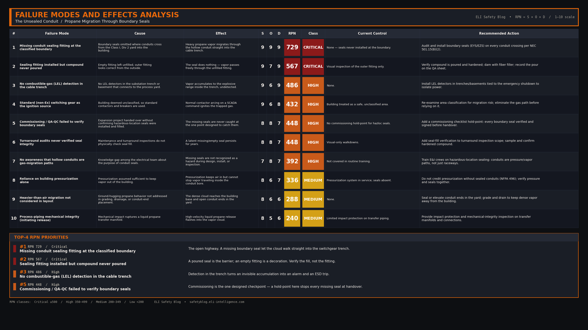

import Quiz from '../../components/Quiz.astro';

### 1. The Hook (Flashpoint)

At 3:05 PM, a blinding fireball and a series of thunderous explosions rocked a petrochemical facility, ripping through a process unit and launching metal shrapnel hundreds of yards. The blast severely burned several operators, shut down the entire chemical plant for months, and resulted in over $50 million in property damage.

### 2. The Setup

It was a clear, dry afternoon with a steady 12 mph wind blowing across the unit. A maintenance crew was performing operations near a liquid propane storage area. During a transfer operation, a mechanical impact ruptured a liquid propane piping manifold, immediately releasing a high-velocity spray of liquid propane. 

The liquid propane vaporized instantly upon contact with the atmosphere, forming a cold, dense, and highly flammable vapor cloud. Because propane vapor is 1.5 times heavier than air, the cloud did not disperse upward; instead, it hugged the ground and began migrating downwind toward a nearby concrete electrical control building (substation). The building housed non-explosion-proof motor starters, PLCs, and heavy-duty 480V air circuit breakers. Although the building interior was designated as an unclassified, safe area, it was surrounded by a Class I, Division 2 process area.

### 3. The Breakdown

1. **The Rupture:** A piping manifold failed, releasing a massive volume of liquid propane which quickly flashed into a heavy vapor cloud.
2. **The Migration:** The ground-hugging propane vapor cloud spread across the gravel pad, reaching the foundation of the concrete substation building.
3. **The Boundary Bypass:** The substation was pressurized to prevent vapor ingress. However, several underground electrical conduits feeding cables from the outdoor process pumps into the building's MCC cable trenches lacked **conduit sealing fittings (chico seals)**.
4. **The Ingress:** The heavy propane vapor entered the open ends of the conduits in the process yard and traveled directly through the hollow pipes, bypassing the building's pressurized walls and emerging directly inside the bottom of the MCC switchgear cable trench.
5. **The Ignition:** As the flammable propane concentration inside the cable trench reached its lower explosive limit (LEL), a routine automatic command from the SCADA system cycled a 480V motor starter. The normal electrical arcing at the contactor tips ignited the trapped propane gas, triggering a powerful explosion that blew the building apart.

### 4. Interactive Quiz

<Quiz 
  question="Why did the propane vapor manage to enter the pressurized substation building?"
  options={[
    "Propane gas is lighter than air and floated through the roof ventilation fans.",
    "The building doors were left wide open by the maintenance crew during their shift.",
    "The absence of conduit sealing fittings allowed the gas to migrate through the inside of the hollow conduits directly into the building's cable trenches.",
    "The pressure relief valve on the propane tank backfired, sending a shockwave through the building walls."
  ]}
  correctAnswer="The absence of conduit sealing fittings allowed the gas to migrate through the inside of the hollow conduits directly into the building's cable trenches."
  explanation="While the building's HVAC pressurization system successfully kept gas from entering through doors and cracks, it could not stop gas from migrating inside the hollow electrical conduits because they lacked code-mandated sealing fittings."
/>

### 5. The RCA

**Direct Cause:**
The direct cause was the ignition of accumulated propane vapor inside the switchgear cable trench by an electrical arc from a standard contactor.

**Systemic/Human Cause:**
The root cause was a failure in electrical design engineering, quality assurance (QA/QC), and code compliance. During a previous expansion project, contractors failed to install explosion-proof conduit sealing fittings at the boundary where conduits exited the Class I, Div 2 area and entered the unclassified building, as mandated by code. The facility's commissioning and maintenance audits failed to identify these missing seals. Furthermore, there was a systemic lack of awareness among the electrical team regarding the risk of hollow conduits acting as gas migration pathways.

### 6. Failure Modes and Effects Analysis (FMEA)

*(Note: FMEA rendering to be completed by Claude editorial agent prior to publication).*

### 7. Applicable Codes & Standards

* **NEC 501.15(B)(2) and 501.15(A)(4) / CEC Section 18-154** — Class I, Division 2 (and Division 1) Boundary Seals: Mandates that a seal be installed in each conduit run passing from a Class I, Division 2 (or Division 1) location into an unclassified location. The sealing fitting must be designed to prevent the passage of gases or vapors.
* **NFPA 496** — Standard for Purged and Pressurized Enclosures for Electrical Equipment: Outlines the design requirements for pressurized control rooms, emphasizing that pressurization is ineffective if conduit seals are missing.
* **API RP 500** — Recommended Practice for Classification of Locations for Electrical Installations at Petroleum Facilities.
* **OSHA 29 CFR 1910.307** — Hazardous (Classified) Locations: Requires that all electrical installations in classified areas meet strict design and sealing standards.

### 8. Free Resource

*[Lead magnet CTA — Claude]*

[Download the Hazardous Locations Conduit Sealing & Boundary Verification Checklist](/downloads/formosa-conduit-seal-checklist.pdf)

### 9. Actionable Takeaways

- **Audit Boundary Conduits:** Conduct a comprehensive audit of all conduits entering switchgear rooms, substations, or control rooms from classified process areas. Verify that physical sealing fittings (e.g., Crouse-Hinds EYS) are present and properly filled with compound (Chico).
- **Inspect Seal Integrity:** Remember that a sealing fitting is useless if it is empty. During turnaround inspections, physically verify that the sealing compound has been poured and has hardened inside the fitting; do not rely on visual inspection of the outer fitting alone.
- **Utilize Gas Detection in Trenches:** Install combustible gas (LEL) detectors inside substation cable trenches and crawlspaces that connect to process areas. Tie these detectors to the emergency shutdown system to isolate power if gas is detected.

### 10. Conclusion

Pressurizing a substation to keep out gas is useless if you leave hollow conduits acting as open highways for explosive vapors to enter your switchgear.

{/*
CONFIG BLOCKS FOR CLAUDE GENERATION

BANNER CONFIG:
{
  "PUB_DATE": "2026-07-07",
  "TITLE": ["THE UNSEALED CONDUIT", "PROPANE GAS IGNITION"],
  "SUBTITLE": "Missing seals let gas bypass pressurized walls",
  "FEATURE_STRIP": "WEEKLY INCIDENT RCA",
  "HAZARDS": [
    ["MISSING CONDUIT SEALS", "L3"],
    ["PROPANE VAPOR MIGRATION", "L3"],
    ["UNCLASSIFIED BUILDING IGNITION", "L3"]
  ],
  "CATEGORIES": "HAZARDOUS LOCATIONS  ·  NEC 501.15  ·  EXPLOSION",
  "SYMBOL_PATH": "rca_symbol.png",
  "OUTPUT_FILE": "../../../ai-in-mining-blog/src/assets/banner-formosa-conduit-seal-explosion.png"
}

FMEA CONFIG:
{
  "incident_name": "The Unsealed Conduit: Propane Gas Ignition",
  "critical_modes": [
    {"mode": "Missing Conduit Sealing Fitting (EYS)", "effect": "Heavy propane vapor migrates through hollow conduit into unclassified building", "rpn": 729},
    {"mode": "Failure to Pour Sealing Compound (Chico)", "effect": "Empty sealing fitting installed, fails to block vapor flow", "rpn": 567}
  ],
  "high_modes": [
    {"mode": "Lack of Gas Detection in Cable Trenches", "effect": "Vapor accumulation inside substation basement goes undetected", "rpn": 480},
    {"mode": "Contactor Spark during Normal Switching", "effect": "Standard electrical contactor sparks, igniting trapped propane gas", "rpn": 405}
  ],
  "medium_modes": [
    {"mode": "Pressurization System Blind Spot", "effect": "Pressurization keeps building air in, but fails to stop gas ingress through conduit", "rpn": 240}
  ]
}

LEAD MAGNET CONFIG:
{
  "title": "Hazardous Locations Conduit Sealing & Boundary Verification Checklist",
  "sections": [
    {"name": "EYS Sealing Fitting Inspection", "items": ["Are EYS or EZS sealing fittings installed at all boundaries exiting classified areas?", "Is the sealing compound (e.g., Chico A) verified poured and hardened?", "Are dams properly installed using fiber filler to prevent compound leakage during pour?"]},
    {"name": "Conduit and Cable Integrity", "items": ["Are cables inside the sealing fitting separated to ensure compound surrounds each conductor?", "Are there any empty or spare conduits entering the building that lack mechanical plugs?", "Are conduit threads fully engaged and tight to maintain explosion-proof rating?"]},
    {"name": "Building Boundary Verification", "items": ["Are all wall and floor cable penetrations sealed with listed fire-stop and gas-tight materials?", "Is the building pressurization system verified functional and maintaining >0.1 inches of water column?", "Are LEL gas detectors installed inside the cable trench or basement and calibrated?"]}
  ]
}

LINKEDIN POST DRAFT:
Hook: Pressurizing your control room to keep out explosive gases? It's useless if you've left a hollow pipe acting as a direct highway to your switchgear.
Setup: A facility suffered a devastating explosion when propane vapor migrated into a concrete substation. The building was pressurized, but the underground conduits entering from the process yard lacked sealing fittings.
Core Failure: Propane vapor is heavier than air. It entered the open conduits in the yard, traveled through the hollow pipes, and emerged inside the switchgear cable trench. A contactor sparked, and the room blew.
Takeaway: Conduit seals (NEC 501.15 / CEC 18-154) are not optional. If you cross a boundary from a classified area to an unclassified one, you MUST install and pour a sealing fitting.
CTA: Does your facility audit conduit seals during turnaround inspections, or do you assume they were poured correctly?
Hashtags: #HazardousLocations #ElectricalCodes #NEC50115 #ChemicalSafety #ProcessSafety #Switchgear
*/}
