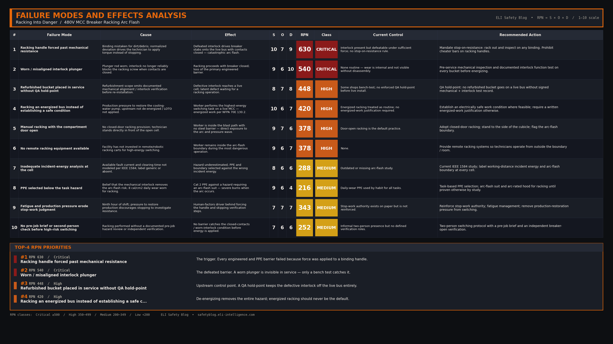

import Quiz from '../../components/Quiz.astro';

### 1. The Hook (Flashpoint)

At 2:14 PM, a loud, thunderous boom echoed through the electrical substation of an oil refinery as a massive 480V arc flash erupted from a Motor Control Center (MCC) column. The blast blew the steel door off the compartment, engulfing a senior maintenance technician in a fireball and leaving him with severe second- and third-degree burns across his upper body.

### 2. The Setup

The day shift had been running smoothly, but fatigue was setting in as the crew entered their ninth hour on site. The weather outside was a humid 88°F, and inside the substation, the air conditioning was struggling to keep the ambient temperature below 75°F. 

The task at hand was routine: rack in a refurbished 100A feeder circuit breaker bucket back into a live 480-volt, 3-phase MCC stack to restore power to a cooling water pump. The maintenance team consisted of the senior technician and an apprentice. Both were wearing standard 8-cal/cm² Category 2 daily arc flash PPE, safety glasses, and leather work gloves. However, they had not donned the heavy-duty 40-cal arc flash suits or voltage-rated rubber gloves, as they believed the mechanical interlocks of the breaker bucket would prevent any hazardous contact during the racking process.

### 3. The Breakdown

1. **The Racking Setup:** The technician opened the compartment door and positioned the refurbished breaker bucket inside the MCC guide rails, preparing to wind the racking screw to connect the bucket's rear "stabs" to the live vertical copper busbars.
2. **The Interference:** As he began to turn the racking handle, the mechanism bound up. The breaker's internal mechanical interlock—designed to prevent racking while the breaker contacts are closed—was misaligned due to wear on the plunger rod.
3. **The Forced Entry:** Believing the binding was just typical dirt in the guide tracks, the technician applied significant torque to the racking handle, forcing the racking screw past the mechanical resistance.
4. **The Fault Injection:** Unknown to the technician, forcing the handle defeated the safety interlock and pushed the breaker stabs into the vertical busbars while the breaker’s internal contacts were closed under a heavy downstream load.
5. **The Blast:** The sudden connection under load drew a severe electrical arc between the breaker stabs and the live busbars. Superheated copper vaporized instantly, expanding 67,000 times in volume and generating an arc flash that reached temperatures of 35,000°F, blowing the bucket out of the cell and severely injuring the technician.

### 4. Interactive Quiz

<Quiz 
  question="What was the primary technical failure that allowed the arc flash to occur during racking?"
  options={[
    "The upstream main transformer suffered a winding insulation breakdown.",
    "Forcing the racking handle defeated a worn mechanical interlock, connecting the breaker stabs to the busbars while the contacts were closed.",
    "The vertical copper busbars in the MCC were undersized for the cooling water pump load.",
    "The daily arc flash PPE worn by the technician was made of combustible synthetic fibers."
  ]}
  correctAnswer="Forcing the racking handle defeated a worn mechanical interlock, connecting the breaker stabs to the busbars while the contacts were closed."
  explanation="Mechanical interlocks are safety barriers that prevent breaker racking while the contacts are closed. Worn mechanisms can allow the interlock to be bypassed under force, resulting in a live connection under load, drawing a catastrophic arc."
/>

### 5. The RCA

**Direct Cause:**
The direct cause was a phase-to-phase and phase-to-ground short circuit created when the breaker stabs engaged the live vertical busbars while the breaker contacts were closed.

**Systemic/Human Cause:**
The root cause was a failure in the facility’s maintenance procedures and safety culture. The refurbished breaker bucket had not undergone pre-installation quality control or mechanical alignment testing. Furthermore, a culture of normalizing deviations led the technician to force a binding racking mechanism rather than stopping to investigate the resistance. Finally, the facility lacked a mandate for "closed-door racking" or remote racking systems, which would have physically isolated the worker from the blast zone.

### 6. Failure Modes and Effects Analysis (FMEA)

*(Note: FMEA rendering to be completed by Claude editorial agent prior to publication).*

### 7. Applicable Codes & Standards

* **NFPA 70E Article 130.2** — Establishing an Electrically Safe Work Condition: Racking a breaker in or out of a live bus is considered energized electrical work.
* **NFPA 70E 130.5** — Arc Flash Risk Assessment: Requires determining the arc flash boundary and the required PPE rating before performing racking operations.
* **OSHA 29 CFR 1910.303(b)(2)** — Suitability of Equipment: Requires that electrical equipment be installed and maintained in accordance with manufacturer instructions.
* **CSA Z462 Clause 4.3** — Work involving electrical hazards: Establishes the hierarchy of risk control, emphasizing substitution (such as remote racking) and engineering controls (like closed-door racking mechanisms) over relying solely on PPE.
* **IEEE 1584** — Guide for Performing Arc-Flash Hazard Calculations: Standard used to calculate the incident energy levels at the working distance.

### 8. Free Resource

*[Lead magnet CTA — Claude]*

[Download the MCC Racking & Isolation Safety Checklist](/downloads/mcc-racking-isolation-safety-checklist.pdf)

### 9. Actionable Takeaways

- **Stop on Resistance:** Never apply force or use cheater bars on racking handles. If a racking mechanism binds, stop immediately, rack the bucket back out, and inspect the alignment of the mechanical interlocks and guide rails.
- **Implement Remote Racking:** Transition to remote racking systems that allow technicians to wind breakers in or out from outside the substation room or beyond the arc flash boundary.
- **Verify Mechanical Tolerances:** Ensure all new or refurbished breaker buckets undergo documented mechanical inspection and interlock verification before being placed into service on live buses.

### 10. Conclusion

A mechanical safety interlock is a critical barrier, but it is not indestructible; if you force it to yield, the electrical system will respond with catastrophic force.

{/*
CONFIG BLOCKS FOR CLAUDE GENERATION

BANNER CONFIG:
{
  "PUB_DATE": "2026-06-23",
  "TITLE": ["RACKING INTO DANGER", "480V MCC ARC FLASH"],
  "SUBTITLE": "Forcing worn interlocks triggers a catastrophic blast",
  "FEATURE_STRIP": "WEEKLY INCIDENT RCA",
  "HAZARDS": [
    ["FORCED MECHANICAL INTERLOCK", "L3"],
    ["MCC BUSBAR ARC FLASH", "L3"],
    ["INADEQUATE PPE SELECTION", "L2"]
  ],
  "CATEGORIES": "ARC FLASH  ·  MCC RACKING  ·  LOTO",
  "SYMBOL_PATH": "rca_symbol.png",
  "OUTPUT_FILE": "../../../ai-in-mining-blog/src/assets/banner-mcc-racking-arc-flash.png"
}

FMEA CONFIG:
{
  "incident_name": "Racking Into Danger: The 480V MCC Arc Flash",
  "critical_modes": [
    {"mode": "Forced Racking Mechanical Interlock", "effect": "Technician forces breaker onto live vertical bus with contacts closed, drawing arc", "rpn": 648},
    {"mode": "Worn or Damaged Interlock Plunger", "effect": "Mechanical interlock fails to lock out racking handle shaft", "rpn": 540}
  ],
  "high_modes": [
    {"mode": "Racking with Compartment Door Open", "effect": "Technician directly exposed to arc flash blast without steel door barrier", "rpn": 480},
    {"mode": "Lack of Remote Racking Equipment", "effect": "Worker stands directly in the blast zone during high-risk switching operation", "rpn": 420}
  ],
  "medium_modes": [
    {"mode": "Inadequate Incident Energy Analysis", "effect": "Underestimation of available fault current leads to insufficient PPE selection", "rpn": 240}
  ]
}

LEAD MAGNET CONFIG:
{
  "title": "MCC Racking & Isolation Safety Checklist",
  "sections": [
    {"name": "Pre-Racking Inspections", "items": ["Verify the breaker contacts are physically and visually confirmed open.", "Inspect racking screw, guide tracks, and interlock plungers for wear or misalignment.", "Ensure no load is present on downstream feeders before beginning racking."]},
    {"name": "PPE & Boundary Controls", "items": ["Verify arc flash hazard labels and check that PPE matches or exceeds calculated incident energy.", "Establish and flag the arc flash boundary to keep non-essential personnel out.", "Utilize voltage-rated gloves and a face shield/hood appropriate for the hazard level."]},
    {"name": "Racking Execution", "items": ["Stop racking immediately if any binding or mechanical resistance is felt.", "Utilize remote racking controls or closed-door racking features wherever available.", "Stand to the side of the cubicle (never directly in front of the door) during manual operations."]}
  ]
}

LINKEDIN POST DRAFT:
Hook: When a breaker racking handle binds, do you stop and investigate, or do you grab a bigger wrench?
Setup: An electrician was racking a 100A breaker bucket into a live 480V MCC. The mechanical interlock—designed to prevent racking while closed—was worn. Instead of checking it, he forced it. 
Core Failure: The bucket was forced onto the live vertical busbars with its main contacts closed. The resulting connection under load drew a massive, vaporizing arc flash, blowing the bucket out and causing severe third-degree burns.
Takeaway: A mechanical safety interlock is a barrier, not an obstacle to bypass. If a breaker resists being racked, there is a reason. Forcing it defeats the only system protecting you from the bus.
CTA: Does your facility permit manual racking with the enclosure door open, or do you mandate closed-door/remote racking?
Hashtags: #ArcFlash #ElectricalSafety #Switchgear #MCC #NFPA70E
*/}
