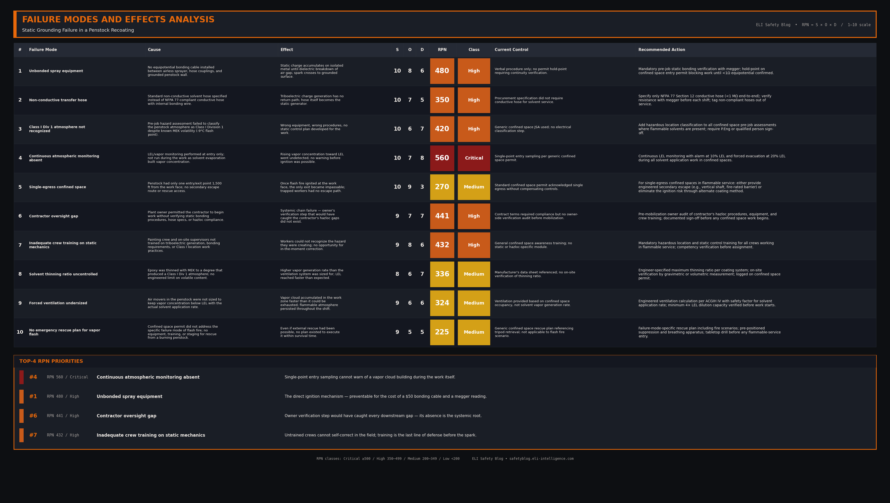

import Quiz from '../../components/Quiz.astro';

### 1. The Hook (Flashpoint)

Five painters were 1,500 feet inside a steel penstock when the air ignited. The flash fire took less than a second to fill the tunnel. None of them made it out.

It happened at a hydroelectric plant where a contractor crew was recoating the interior of a drained penstock. The ignition source was a single static spark — and the missing piece of equipment that would have prevented it cost less than fifty dollars.

### 2. The Setup

The penstock was an enormous, grounded steel tunnel — a buried pressure pipe carrying water from the reservoir to the turbines. It had been drained for a recoating project. A contractor crew was applying an epoxy lining to the interior wall.

Because the epoxy was highly viscous, the contractor thinned it with Methyl Ethyl Ketone (MEK) — a highly flammable solvent with a flash point of -9°C. As the solvent evaporated off the freshly sprayed surface, it built a flammable vapor cloud inside the confined tunnel. The atmosphere fit the definition of a Class I, Division 1 hazardous location.

In any environment containing flammable vapors, the movement of liquids through hoses inherently generates static electricity through triboelectric friction. If isolated metal components are not bonded to the surrounding equipotential network, that charge accumulates until the voltage potential exceeds the dielectric breakdown of the air gap — and a spark crosses to the nearest grounded surface.

### 3. The Breakdown

A federal incident investigation identified the exact sequence of electrical failures:

1. The painters were using an airless sprayer to apply the epoxy. As the thinned epoxy moved rapidly through the non-conductive hose, a massive static charge was generated via triboelectric friction.
2. The spray nozzle and the spraying machine were isolated metal components. The contractor had **failed to install equipotential bonding cables** between the sprayer, the hose, and the grounded steel penstock.
3. Because the equipment was unbonded, the static charge had nowhere to go. It accumulated on the metal sprayer components, building a massive potential difference relative to the steel pipe.
4. When the voltage exceeded the dielectric strength of the air gap between the metal sprayer and the grounded penstock wall, a static spark jumped across the gap.
5. The spark ignited the concentrated MEK vapors, triggering a flash fire that propagated through the entire confined space within seconds.

### 4. Knowledge Check

<Quiz 
  question="Why did the static charge build up on the spraying equipment instead of dissipating?"
  options={[
    "The 120V power supply was faulty.",
    "The MEK solvent was too volatile to safely contain.",
    "The equipment lacked equipotential bonding wires to provide a continuous, low-resistance path to ground.",
    "The solvent used was an electrical insulator."
  ]}
  correctAnswerIndex={2}
  explanation="The static charge accumulated because the spraying equipment was electrically isolated. Without equipotential bonding wires connecting the metal components to each other and to the grounded steel penstock, the static charge could not safely dissipate, leading to a high-voltage spark."
/>

### 5. The RCA

**Direct Cause**
A static electric spark discharged from unbonded epoxy spraying equipment to the grounded steel penstock wall, igniting a flammable MEK vapor cloud.

**Systemic / Human Cause**
Multiple system-level failures allowed the direct cause to occur:

- **Inadequate contractor pre-job hazard assessment.** The Class I Division 1 atmosphere was not formally recognized despite the known volatility of MEK. No static control plan was developed.
- **Plant owner oversight gap.** The owner permitted the contractor to begin work without verifying static bonding procedures, conductive hose specifications, or hazardous location compliance.
- **Confined space permit deficiencies.** Atmospheric monitoring was performed only at entry — not continuously during work — so the rising vapor concentration went undetected.
- **Egress design failure.** The penstock had only one exit, with no provision for emergency escape during a vapor flash event.
- **Training gap.** Neither the painting crew nor the on-site supervisors had been trained on the static generation mechanics of solvent transfer or the bonding requirements for Class I locations.

The federal investigation explicitly faulted both the contractor and the plant owner for these failures. This was not a worker mistake — it was a chain of unverified procedural and oversight gaps.

### 6. Failure Modes and Effects Analysis (FMEA)

The full failure mode breakdown — 10 failure modes scored on Severity × Occurrence × Detection — exposes the cascade of equipment, procedural, training, and oversight gaps that allowed a single static spark to become a multi-fatality event. The top RPN priority is continuous atmospheric monitoring (Critical, RPN 560): single-point entry sampling cannot warn of a vapor cloud building during the work itself.

*Click to expand the full FMEA table.*

### 7. Codes & Standards

**Canadian**
- **CEC Section 18** — Hazardous locations (Class I Division 1 classification and equipment requirements)
- **CEC Section 10** — Grounding and bonding (equipotential bonding of conductive equipment)
- **CSA Z462** — Workplace electrical safety, including hazardous location work practices

**American**
- **NFPA 77** — Static electricity bonding and grounding for flammable liquid transfer
- **API RP 2003** — Static, lightning, and stray current protection in fluid handling
- **NFPA 70 (NEC) Article 500/501** — Class I Division 1 hazardous location requirements
- **OSHA 29 CFR 1910.106** — Bonding requirements for Class I flammable liquid dispensing

### 8. Field Checklist

The verification gaps behind this incident are still common on industrial coating jobs today. We've packaged the bonding, monitoring, and egress checks into a 14-point pre-job checklist for solvent transfer in Class I Division 1 confined spaces — the version every contractor crew should be running before any work in a flammable atmosphere.

[**Download the Static Bonding Verification Checklist (PDF)**](/downloads/static-bonding-verification-checklist.pdf)

### 9. Actionable Takeaways

1. **Bond Everything in Hazardous Areas.** In any environment with flammable vapors, all conductive equipment (pumps, hoses, nozzles, buckets) must be electrically bonded together to eliminate potential differences, then tied to a verified earth ground. Verify continuity with a megger before each shift.
2. **Fluid Movement Generates Voltage.** Never underestimate static generation. Moving fluids, powders, or gases through non-conductive pipes acts like a Van de Graaff generator. Without a bonding path, a spark is inevitable.
3. **Specify Conductive Hoses to NFPA 77.** End-to-end resistance under 1 MΩ, with internal bonding wire continuous from coupling to coupling. Marketing claims of "conductive" without a megger reading mean nothing.
4. **Monitor the Atmosphere Continuously.** Single-point entry sampling is not sufficient when solvent vapors are being generated by the work itself. LEL monitors must run for the duration of the task.
5. **Verify Egress Before You Light Anything.** A confined space with one exit and a flammable atmosphere is a deathtrap. Either provide a second escape route or eliminate the ignition risk.

### 10. Closing Statement

Static is silent, invisible, and patient — it waits for an unbonded path and turns fluid motion into ignition.

{/* 
IMAGE PROMPT (Imagen 3):
Close-up of a heavy-duty copper static grounding clamp with sharp teeth gripping a steel pipe, thick green grounding wire, surface oxidation, single warm sidelight from left, dark background.

LINKEDIN DRAFT:
A missing piece of copper wire cost five people their lives. ⚡

A flash fire inside a drained penstock at a hydroelectric plant killed five workers. They were spraying epoxy thinned with a flammable solvent.

Moving fluids through a hose inherently generates static electricity. Because the contractor failed to install equipotential bonding wires, the static charge accumulated on the isolated metal sprayer. When the voltage got high enough, it jumped to the grounded steel wall of the penstock.

That single static spark ignited the solvent vapors.

In hazardous locations (Class I Div 1), static bonding isn't optional. Every pump, hose, and nozzle must be bonded together and tied to earth. Fluid movement is a generator. Give the voltage a path home.

What does your facility require before any solvent transfer in a confined space — and when was it last audited? 👇

[BLOG_LINK_PLACEHOLDER]

#ElectricalSafety #Grounding #StaticElectricity #ProcessSafety #NFPA77
*/}
